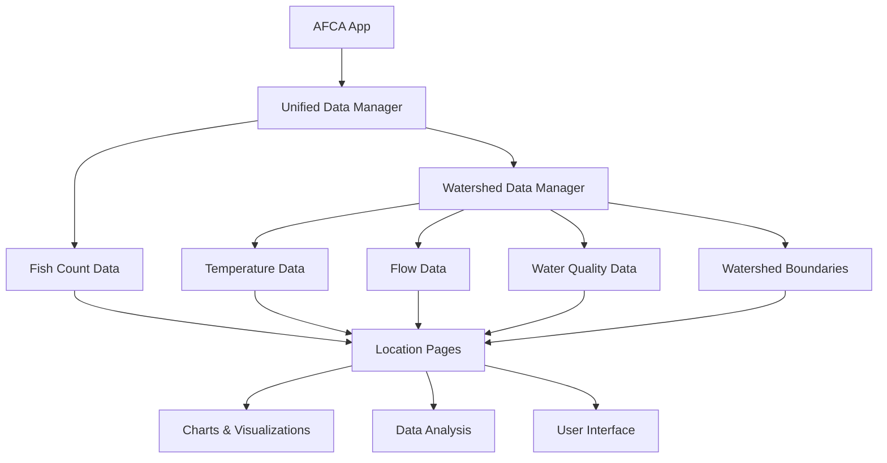

# AFCA Watershed Dataset Integration Architecture

## Overview

The AFCA Watershed Dataset integrates with the Alaska Fish Count App (AFCA) through the existing **Unified Data Manager** architecture, following the established patterns for data loading, caching, and GitHub CDN integration.

## Current AFCA Architecture

### 1. **Unified Data Manager (UDM)**
- **Location**: `afca-app-v101/temp-clean-deploy/js/unified-data-manager.js`
- **Purpose**: Centralized data management system
- **Pattern**: Local data first, GitHub CDN fallback
- **Base URL**: `https://raw.githubusercontent.com/alaskafishcounts/adfg-dataset/master`

### 2. **Data Structure**
```
afca-app-v101/data/01-master/
├── master-locations.json      # Location metadata
├── master-species.json        # Species definitions
├── master-goals.json          # Escapement goals
├── master-regions.json        # Regional boundaries
└── master-sources.json        # Data source documentation
```

### 3. **Manifest System**
- **File**: `manifest.json` in repository root
- **Structure**: `organized[locationId][speciesId][year]`
- **Purpose**: Efficient data path resolution

## Watershed Dataset Integration

### 1. **Repository Structure**
```
afca-watershed-dataset/
├── data/
│   ├── 01-master/              # Master watershed configuration
│   ├── 02-watersheds/          # Watershed boundary data
│   ├── 03-temperature/         # Temperature monitoring data
│   ├── 04-quality/            # Water quality parameters
│   └── 05-flow/               # Stream flow measurements
├── manifest.json               # Watershed data manifest
└── docs/                      # Integration documentation
```

### 2. **Integration Points**

#### A. **Unified Data Manager Extension**
```javascript
// Add to UnifiedDataManager class
class UnifiedDataManager {
  constructor() {
    // Existing initialization...
    
    // Watershed dataset configuration
    this.watershedBaseUrl = 'https://raw.githubusercontent.com/alaskafishcounts/afca-watershed-dataset/main';
    this.watershedManifest = null;
    this.watershedCache = new Map();
  }

  // New method for watershed data
  async loadWatershedManifest() {
    try {
      const response = await fetch(`${this.watershedBaseUrl}/manifest.json`);
      this.watershedManifest = await response.json();
      return this.watershedManifest;
    } catch (error) {
      console.error('Error loading watershed manifest:', error);
      return null;
    }
  }

  async loadWatershedData(locationId, parameter, year) {
    if (!this.watershedManifest) {
      await this.loadWatershedManifest();
    }

    try {
      const filePath = this.watershedManifest.organized[locationId][parameter][year];
      const response = await fetch(`${this.watershedBaseUrl}/${filePath}`);
      return await response.json();
    } catch (error) {
      console.error(`Error loading watershed data:`, error);
      return null;
    }
  }
}
```

#### B. **Location Page Integration**
```javascript
// Add to location page components
class LocationPage {
  async loadLocationData(locationId, year) {
    // Existing fish count data loading...
    const fishCounts = await this.dataManager.loadDataForYear(year);
    
    // New watershed data loading
    const temperatureData = await this.dataManager.loadWatershedData(locationId, 'temperature', year);
    const flowData = await this.dataManager.loadWatershedData(locationId, 'flow', year);
    const qualityData = await this.dataManager.loadWatershedData(locationId, 'quality', year);
    const watershedData = await this.dataManager.loadWatershedData(locationId, 'watershed', null);
    
    return {
      fishCounts,
      temperature: temperatureData,
      flow: flowData,
      quality: qualityData,
      watershed: watershedData
    };
  }
}
```

#### C. **Chart Integration**
```javascript
// Add to chart components
class LocationCharts {
  createTemperatureChart(locationId, year) {
    // Load temperature data
    const tempData = await this.dataManager.loadWatershedData(locationId, 'temperature', year);
    
    // Create Chart.js temperature chart
    const chart = new Chart(ctx, {
      type: 'line',
      data: {
        labels: tempData.data.map(d => d.date),
        datasets: [{
          label: 'Water Temperature (°C)',
          data: tempData.data.map(d => d.temperature_c),
          borderColor: 'rgb(75, 192, 192)',
          backgroundColor: 'rgba(75, 192, 192, 0.2)'
        }]
      },
      options: {
        responsive: true,
        scales: {
          y: {
            beginAtZero: false,
            title: { display: true, text: 'Temperature (°C)' }
          }
        }
      }
    });
  }
}
```

### 3. **Data Flow Architecture**



### 4. **File Structure Integration**

#### A. **Master Files Extension**
```javascript
// Add to master-locations.json
{
  "410": {
    "id": 410,
    "name": "Kenai River",
    "region": "Southcentral",
    "gps": [60.4878, -151.0583],
    "watershed_data": {
      "available": true,
      "parameters": ["temperature", "flow", "quality"],
      "years": [2022, 2023, 2024],
      "source": "afca-watershed-dataset"
    }
  }
}
```

#### B. **Manifest Integration**
```javascript
// Add to main manifest.json
{
  "version": "3.0.0",
  "datasets": {
    "fish_counts": {
      "source": "adfg-dataset",
      "manifest": "https://raw.githubusercontent.com/alaskafishcounts/adfg-dataset/master/manifest.json"
    },
    "watershed_data": {
      "source": "afca-watershed-dataset", 
      "manifest": "https://raw.githubusercontent.com/alaskafishcounts/afca-watershed-dataset/main/manifest.json"
    }
  }
}
```

### 5. **Caching Strategy**

```javascript
// Extend existing cache system
class UnifiedDataManager {
  constructor() {
    // Existing cache...
    this.watershedCache = new Map();
    this.watershedCacheTimeout = 300000; // 5 minutes
  }

  async loadWatershedData(locationId, parameter, year) {
    const cacheKey = `watershed_${locationId}_${parameter}_${year}`;
    
    // Check cache first
    if (this.watershedCache.has(cacheKey)) {
      const cached = this.watershedCache.get(cacheKey);
      if (Date.now() - cached.timestamp < this.watershedCacheTimeout) {
        return cached.data;
      }
    }

    // Load from GitHub
    const data = await this.fetchWatershedData(locationId, parameter, year);
    
    // Cache the result
    this.watershedCache.set(cacheKey, {
      data,
      timestamp: Date.now()
    });

    return data;
  }
}
```

### 6. **Error Handling**

```javascript
// Add to UnifiedDataManager
async loadWatershedData(locationId, parameter, year) {
  try {
    // Primary data source
    const data = await this.fetchWatershedData(locationId, parameter, year);
    return data;
  } catch (error) {
    console.warn(`Watershed data unavailable for location ${locationId}:`, error);
    
    // Return null or default data structure
    return {
      location_id: locationId,
      location_name: "Unknown Location",
      year: year,
      parameter: parameter,
      data: [],
      statistics: { mean: null, min: null, max: null, count: 0 },
      source: "afca-watershed-dataset",
      error: "Data unavailable"
    };
  }
}
```

### 7. **Performance Considerations**

#### A. **Lazy Loading**
```javascript
// Load watershed data only when needed
class LocationPage {
  async initialize() {
    // Load fish count data immediately
    await this.loadFishCountData();
    
    // Load watershed data only when user requests it
    this.watershedDataLoaded = false;
  }

  async loadWatershedData() {
    if (!this.watershedDataLoaded) {
      this.watershedData = await this.dataManager.loadWatershedData(this.locationId, 'temperature', this.year);
      this.watershedDataLoaded = true;
    }
    return this.watershedData;
  }
}
```

#### B. **Batch Loading**
```javascript
// Load multiple parameters at once
async loadAllWatershedData(locationId, year) {
  const parameters = ['temperature', 'flow', 'quality'];
  const promises = parameters.map(param => 
    this.dataManager.loadWatershedData(locationId, param, year)
  );
  
  const results = await Promise.all(promises);
  return {
    temperature: results[0],
    flow: results[1],
    quality: results[2]
  };
}
```

### 8. **UI Integration**

#### A. **Location Page Tabs**
```html
<!-- Add to location page template -->
<div class="location-tabs">
  <button @click="activeTab = 'fish-counts'" :class="{ active: activeTab === 'fish-counts' }">
    Fish Counts
  </button>
  <button @click="activeTab = 'water-data'" :class="{ active: activeTab === 'water-data' }">
    Water Data
  </button>
  <button @click="activeTab = 'watershed'" :class="{ active: activeTab === 'watershed' }">
    Watershed
  </button>
</div>

<div x-show="activeTab === 'water-data'">
  <div class="water-data-charts">
    <canvas id="temperature-chart"></canvas>
    <canvas id="flow-chart"></canvas>
    <canvas id="quality-chart"></canvas>
  </div>
</div>
```

#### B. **Data Correlation Views**
```html
<!-- Correlation between fish counts and water temperature -->
<div class="correlation-view">
  <h3>Fish Counts vs Water Temperature</h3>
  <canvas id="correlation-chart"></canvas>
  <div class="correlation-stats">
    <span>Correlation: <span x-text="correlationCoefficient"></span></span>
    <span>Peak Temperature: <span x-text="peakTemperature"></span>°C</span>
    <span>Peak Fish Count: <span x-text="peakFishCount"></span></span>
  </div>
</div>
```

### 9. **Deployment Strategy**

#### A. **Development Testing**
```javascript
// Add to UnifiedDataManager for development
constructor() {
  this.isDevelopment = window.location.hostname === 'localhost';
  
  if (this.isDevelopment) {
    // Use local watershed data for testing
    this.watershedBaseUrl = '/data/watershed-test';
  } else {
    // Use GitHub CDN in production
    this.watershedBaseUrl = 'https://raw.githubusercontent.com/alaskafishcounts/afca-watershed-dataset/main';
  }
}
```

#### B. **Production Deployment**
1. **Data Repository**: Push watershed data to GitHub
2. **App Repository**: Update AFCA app with watershed integration
3. **CDN**: GitHub CDN serves watershed data
4. **Caching**: Browser and service worker caching
5. **Monitoring**: Track data access and performance

### 10. **Future Enhancements**

#### A. **Real-time Data**
```javascript
// Add real-time USGS data integration
class RealTimeWatershedData {
  async loadRealTimeData(stationId) {
    const response = await fetch(`https://waterservices.usgs.gov/nwis/iv/?format=json&sites=${stationId}&parameterCd=00060,00010`);
    return await response.json();
  }
}
```

#### B. **Predictive Analysis**
```javascript
// Add predictive water temperature modeling
class WaterTemperaturePredictor {
  predictTemperature(locationId, date) {
    // Use historical data and weather forecasts
    // Return predicted temperature for spawning season
  }
}
```

#### C. **Mobile Optimization**
```javascript
// Optimize for mobile devices
class MobileWatershedView {
  constructor() {
    this.isMobile = window.innerWidth < 768;
    this.chartOptions = this.isMobile ? this.mobileChartOptions : this.desktopChartOptions;
  }
}
```

## Implementation Timeline

### Phase 1: Core Integration (Week 1-2)
- [ ] Extend UnifiedDataManager with watershed data methods
- [ ] Add watershed manifest loading
- [ ] Implement basic data fetching and caching
- [ ] Add error handling and fallbacks

### Phase 2: UI Integration (Week 3-4)
- [ ] Add water data tabs to location pages
- [ ] Create temperature and flow charts
- [ ] Implement data correlation views
- [ ] Add watershed boundary maps

### Phase 3: Advanced Features (Week 5-6)
- [ ] Add real-time data integration
- [ ] Implement predictive analysis
- [ ] Add mobile optimization
- [ ] Create data export functionality

### Phase 4: Production Deployment (Week 7-8)
- [ ] Deploy to production environment
- [ ] Monitor performance and usage
- [ ] Gather user feedback
- [ ] Optimize based on usage patterns

## Conclusion

The AFCA Watershed Dataset integrates seamlessly with the existing AFCA architecture through the Unified Data Manager pattern. This approach maintains consistency with the current codebase while adding powerful water data capabilities that enhance the user experience and provide valuable insights into the relationship between water conditions and fish populations.

The integration follows AFCA's established patterns for:
- **Data Loading**: Manifest-driven, GitHub CDN-based
- **Caching**: Efficient browser and service worker caching
- **Error Handling**: Graceful degradation and fallbacks
- **Performance**: Lazy loading and batch operations
- **UI/UX**: Consistent with existing location page design

This architecture ensures the watershed dataset becomes a natural extension of the AFCA ecosystem, providing users with comprehensive environmental context for understanding Alaska's fish populations.
